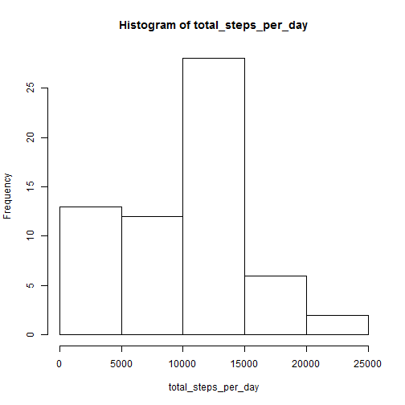
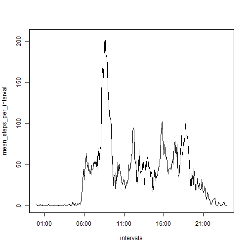
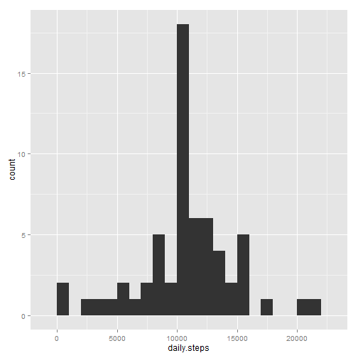
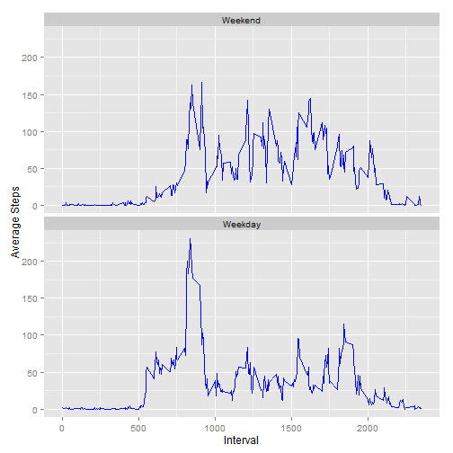

Reproducible Research: Peer Assessment 1
---

This constitutes the first assignment of the Reproducible Research course offered by JHU as part of the Data Science specialisation. 

It is now possible to collect a large amount of data about personal movement using activity monitoring devices such as a Fitbit, Nike Fuelband, or Jawbone Up. This assignment makes use of data from a personal activity monitoring device. This device collects data at 5 minute intervals through out the day. The data consists of two months of data from an anonymous individual collected during the months of October and November, 2012 and include the number of steps taken in 5 minute intervals each day.

##Loading and preprocessing the data

First we will load the data as well as all necessary packages


```r
##Loading the activity file as well as all necessary packages
library(plyr)
library(ggplot2)
library(timeDate)
activity <- read.csv("activity.csv")
```

```
## Warning in file(file, "rt"): cannot open file 'activity.csv': No such file
## or directory
```

```
## Error in file(file, "rt"): cannot open the connection
```

##What is mean total number of steps taken per day?

For this part of the assignment, you can ignore the missing values in the dataset.

First, we calculate the total number of steps taken per day:


```r
total_steps_per_day <- tapply(activity$steps, activity$date, sum, na.rm=TRUE)
total_steps_per_day
```

```
## 2012-10-01 2012-10-02 2012-10-03 2012-10-04 2012-10-05 2012-10-06 
##          0        126      11352      12116      13294      15420 
## 2012-10-07 2012-10-08 2012-10-09 2012-10-10 2012-10-11 2012-10-12 
##      11015          0      12811       9900      10304      17382 
## 2012-10-13 2012-10-14 2012-10-15 2012-10-16 2012-10-17 2012-10-18 
##      12426      15098      10139      15084      13452      10056 
## 2012-10-19 2012-10-20 2012-10-21 2012-10-22 2012-10-23 2012-10-24 
##      11829      10395       8821      13460       8918       8355 
## 2012-10-25 2012-10-26 2012-10-27 2012-10-28 2012-10-29 2012-10-30 
##       2492       6778      10119      11458       5018       9819 
## 2012-10-31 2012-11-01 2012-11-02 2012-11-03 2012-11-04 2012-11-05 
##      15414          0      10600      10571          0      10439 
## 2012-11-06 2012-11-07 2012-11-08 2012-11-09 2012-11-10 2012-11-11 
##       8334      12883       3219          0          0      12608 
## 2012-11-12 2012-11-13 2012-11-14 2012-11-15 2012-11-16 2012-11-17 
##      10765       7336          0         41       5441      14339 
## 2012-11-18 2012-11-19 2012-11-20 2012-11-21 2012-11-22 2012-11-23 
##      15110       8841       4472      12787      20427      21194 
## 2012-11-24 2012-11-25 2012-11-26 2012-11-27 2012-11-28 2012-11-29 
##      14478      11834      11162      13646      10183       7047 
## 2012-11-30 
##          0
```

Then we draw a histogram of the total number of steps taken each day, using baseplot:

```r
hist(total_steps_per_day)
```

 

Calculate and report the mean and median of the total number of steps taken per day


```r
#Average total number of steps taken per day
mean1 <- mean(total_steps_per_day, na.rm=TRUE)
mean1
```

```
## [1] 9354.23
```


```r
#Median total number of steps taken per day
median1 <- median(total_steps_per_day,na.rm=TRUE)
median1
```

```
## [1] 10395
```

##What is the average daily activity pattern?

First, we want to modify our dataframes so that we can draw the plot requested:


```r
# Create a new activity datafram (act2) and modify the class of the interval
act2 <- activity
act2$interval <- factor(act2$interval)
# Calculate mean steps per interval
mean_steps_per_interval <- tapply(act2$steps, act2$interval, mean, na.rm=TRUE)

# Create a new variable "intervals" which is converted to POSIXct
intervals <- strptime(sprintf("%04d", as.numeric(names(mean_steps_per_interval))), format="%H%M")
```

Then we draw the plot:


```r
#Create a time series plot of the 5-minute interval (x-axis) and the average number of steps taken, averaged across all days (y-axis)
plot(intervals,mean_steps_per_interval,type="l")
```

 

Finally, we calculate the interval which is characterised by the maximum number of steps:


```r
# I create a new data fram with mean_steps_per_interval and intervals, so that I can extract the requested value easily
d <- data.frame(mean_steps_per_interval,intervals)
#Interval during which the largest number of steps was monitored
maxSteps <- d[which(d$mean_steps_per_interval == max(d$mean_steps_per_interval)), ]
maxSteps
```

```
##     mean_steps_per_interval           intervals
## 835                206.1698 2015-07-19 08:35:00
```

##Imputing missing values

Note that there are a number of days/intervals where there are missing values (coded as NA). The presence of missing days may introduce bias into some calculations or summaries of the data.

Calculate and report the total number of missing values in the dataset (i.e. the total number of rows with NAs):


```r
#Count the number of rows that have missing values
sum(!complete.cases(activity))
```

```
## [1] 2304
```
Devise a strategy for filling in all of the missing values in the dataset. The strategy does not need to be sophisticated. We decide to fill NAs with the average daily interval value for that NA.


```r
#Define a function impute.mean
impute.mean <- function(x) replace(x, is.na(x), mean(x, na.rm = TRUE))
#Create activity 2,where missing values are replaced with the average for that time interval
activity2 <- ddply(activity, "interval", transform, steps = impute.mean(steps))

# Summarize new data with the NA values replaced
daily_activity2 <- ddply(activity2, "date", summarize, daily.steps = sum(steps))
#Plot Historgam, this time with ggplot2
qplot(daily.steps, data=daily_activity2, geom="histogram", binwidth=1000)
```

 

Calculate and report the mean and median total number of steps taken per day, with NAs replaced:


```r
#Calculating new mean
new_mean <- mean(daily_activity2$daily.steps, na.rm=TRUE)
new_mean
```

```
## [1] 10766.19
```


```r
#Calculating new median
new_median <- median(daily_activity2$daily.steps, na.rm=TRUE)
new_median
```

```
## [1] 10766.19
```

How are the new numbers different to the ones with the NAs values not replaced?

Mean difference (current-previous):


```r
mean_diff <- new_mean - mean1
mean_diff
```

```
## [1] 1411.959
```

Median difference (current-previous):


```r
median_diff <- new_median - median1
median_diff
```

```
## [1] 371.1887
```

So, the difference between the new and old mean values is 1411.959171, while the difference between the new and old median values is 371.1886792. 


##Are there differences in activity patterns between weekdays and weekends

First, we will identify weekdays vs weekends


```r
# Is this a weekday or not?
activity2$weekday <- factor(isWeekday(activity2$date,wday=1:5),
                            labels=c('Weekend', 'Weekday'))
average.weekday <- ddply(activity2, c("interval","weekday"), summarize, steps = mean(steps))
```

Then, we will count average steps on weekends and weekdays and we will compare them:


```r
# Average steps: Weekday vs Weekend
aggregate(steps~weekday, data=average.weekday, FUN='sum')
```

```
##   weekday    steps
## 1 Weekend 12201.52
## 2 Weekday 10255.85
```

Finally, we make a panel plot containing a time series plot of the 5-minute interval (x-axis) and the average number of steps taken, averaged across all weekday days or weekend days (y-axis)


```r
#Plot for weekdays and weekends
ggplot(average.weekday, aes(interval,steps)) + geom_line(color="blue") + xlab("Interval") +ylab("Average Steps") + facet_wrap(~weekday, nrow=2)
```

 

